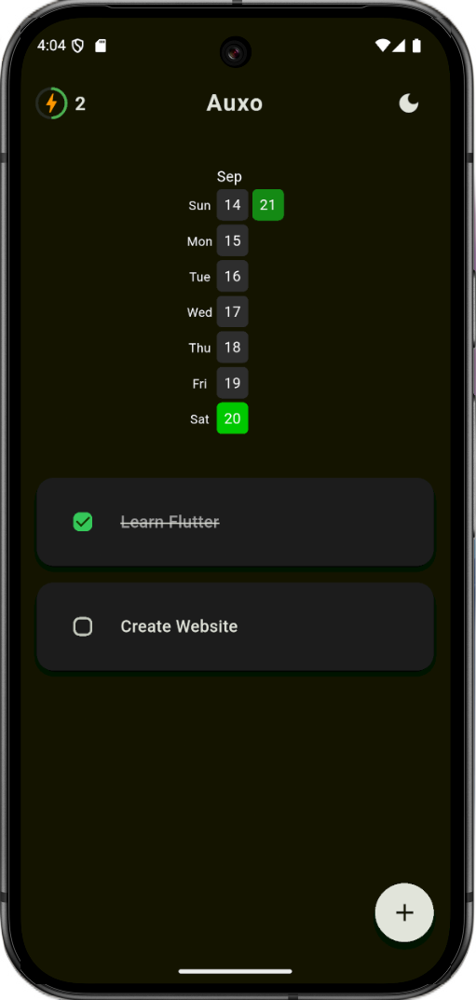
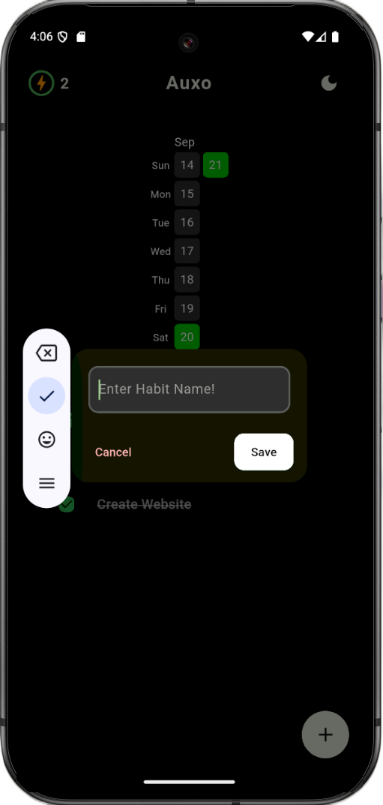
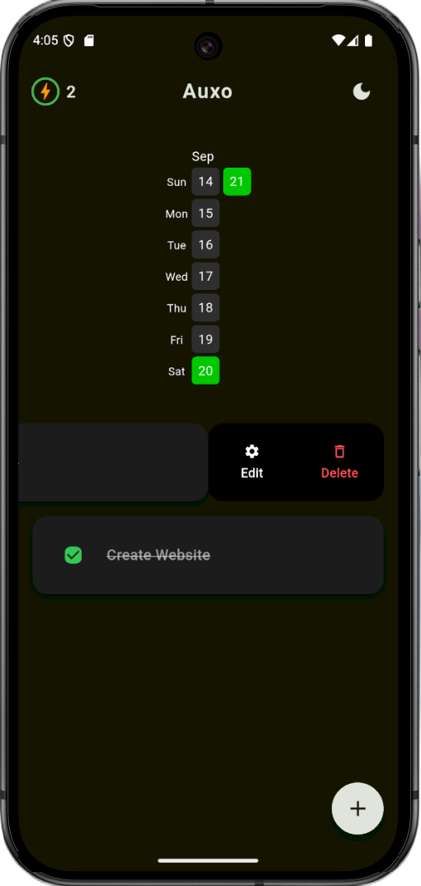

<p align="center">
  
</p>
<h1 align="center">Auxo </h1>
<p align="center">

<p align="center">
Auxo is a free, cross-platform habit tracker built with Flutter. It features a clean, minimal UI, a GitHub-style heatmap to track streaks, offline support, and simple functionality to create, edit, and delete habits. There’s also a special “meme version” with fun anime references. Ready to use – APK available for download!
</p>

<p align="center">
  
  
  
  
  
</p>

---

## 🎯 Project Vision

Auxo helps you build and maintain healthy habits with a simple, clean interface. Its features make habit tracking easy, fun, and motivating:  

- GitHub-style heatmap to visualize streaks  
- Create, edit, and delete habits with ease  
- Offline support so your habits are always tracked  
- Minimal, distraction-free design  
- Special “meme version” with cute anime references  

Auxo is free for everyone and designed to make habit tracking enjoyable.

---

## ✨ Download & Links

- **Website**: [Auxo Tracker](https://auxo.pythonanywhere.com/) - Download APK  
- **APK Download**: Available for Android from the website  
- **iOS**: Coming soon  

---

## 📸 Screenshots


<p align="center">
  
  
  
</p>


<p align="center"><em>Auxo features a clean UI with GitHub-style heatmaps to visualize habit streaks and both dark and light modes</em></p>

---

## 🌟 Features

- **Cross-Platform**: Flutter-based app for Android (iOS coming soon)  
- **Offline Support**: Track habits without an internet connection  
- **Habit Management**: Create, edit, and delete habits easily  
- **Streak Visualization**: GitHub-style heatmap for motivation  
- **Minimal UI**: Clean and intuitive interface  
- **Meme Version**: Fun anime-themed version for added enjoyment  
- **Free to Use**: No hidden costs  

---

## 🖥️ Technology Stack

- **Framework**: Flutter for cross-platform development  
- **Programming Language**: Dart  
- **UI**: Custom minimal interface with animated heatmap widgets  
- **Hosting**: PythonAnywhere for APK downloads  

---

## 🚀 Getting Started

### Prerequisites
- Flutter SDK 3.13+  
- Android Studio / Xcode (for iOS build)  
- Git  

### Installation (for development)
1. Clone the repository:
   ```bash
   git clone https://github.com/Rexaintreal/Auxo.git
   cd Auxo
   ```

2. Install dependencies:
   ```bash
   flutter pub get
   ```

4. Build for your platform:
   ```bash
   flutter run
   ```

---

## 📂 Project Structure

```
Apollo/
├── lib/                # Dart source code
├── assets/             # Logo, screenshots, images
├── web/
├── pubspec.yaml
├── README.md
└── LICENSE
```

---

## ⚠️ Current Status

- **Android APK**: Available now  
- **iOS**: Coming soon  

Auxo is in active development. Feedback and contributions are welcome!

---

## 🔮 Future Plans

- **iOS Release**: Full support for Apple devices  
- **Custom Reminders**: Schedule habit notifications 
- **Statistics & Insights**: Track habit progress over time
- **More Meme Themes**: Fun and interactive versions for motivation 
- **Performance Optimizations**: Smooth animations and fast UI
- **Local Notifications**: Reminders to maintain consistency

---

## 🤝 Contributing

Contributions are welcome!  

1. Fork the repository  
2. Create a branch: `git checkout -b feature/amazing-feature`  
3. Make your changes  
4. Commit: `git commit -m 'Add some amazing feature'`  
5. Push: `git push origin feature/amazing-feature`  
6. Open a Pull Request  

---

## 📜 License

This project is licensed under the [MIT License](LICENSE).  

---

## 💡 You may also like...

- [Libro Voice](https://github.com/Rexaintreal/Libro-Voice) - A PDF to Audio Converter
- [Snippet Vision](https://github.com/Rexaintreal/Snippet-Vision) - A YouTube Video Summarizer
- [Weather App](https://github.com/Rexaintreal/WeatherApp) - A Python Weather Forecast App
- [Python Screenrecorder](https://github.com/Rexaintreal/PythonScreenrecorder) - A Python Screen Recorder
- [Typing Speed Tester](https://github.com/Rexaintreal/TypingSpeedTester) - A Python Typing Speed Tester
- [Movie Recommender](https://github.com/Rexaintreal/Movie-Recommender) - A Python Movie Recommender
- [Password Generator](https://github.com/Rexaintreal/Password-Generator) - A Python Password Generator
- [Object Tales](https://github.com/Rexaintreal/Object-Tales) - A Python Image to Story Generator
- [Finance Manager](https://github.com/Rexaintreal/Finance-Manager) - A Flask WebApp to Monitor Savings
- [Codegram](https://github.com/Rexaintreal/Codegram) - A Social Media Web App for Coders
- [Simple Flask Notes](https://github.com/Rexaintreal/Simple-Flask-Notes) - A Flask Notes App
- [Key5](https://github.com/Rexaintreal/key5) - Python Keylogger
- [Codegram2024](https://github.com/Rexaintreal/Codegram2024) - A Modern Version of Codegram (Update)
- [Cupid](https://github.com/Rexaintreal/cupid) - A Dating Web App for Teenagers
- [Gym Vogue](https://github.com/Rexaintreal/GymVogue/) - Ecommerce Site for Gym Freaks
- [Confessions](https://github.com/Rexaintreal/Confessions) - Anonymous confession platform
- [Syna](https://github.com/Rexaintreal/syna) - A social music web application where users can log in using their Spotify accounts and find their best matches based on shared music preferences
- [Apollo](https://github.com/Rexaintreal/Apollo) - A Minimal Music Player with a Cat Dancing/Bopping to the beats

---

## 👨‍💻 Author

Apollo was created by **Saurabh Tiwari**  

- 📧 Email: [saurabhtiwari7986@gmail.com](mailto:saurabhtiwari7986@gmail.com)  
- 🐦 Twitter: [@Saurabhcodes01](https://x.com/Saurabhcodes01)
- 📱 Instagram: [@saurabhcodesawfully](https://instagram.com/saurabhcodesawfully)
